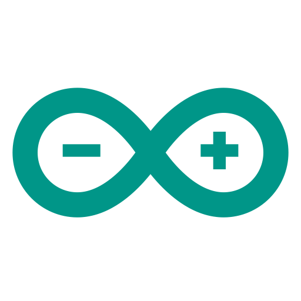

# Hey! I'm Malolan!

## Who am I?

I'm a robotics enthusiast currently seeking higher education.

## What do I do?

I work on various projects related to robotics, and I spend time on platforms such as YouTube, Coursera and Udemy learning new stuff. Learning something new feels amazing, doesn't it? 🔥

## Some top projects:

- Agribot (Agriculture Robot)
- Neural Network based Quadcopter Controller
- Shared Transport Management System
- Robot for visual Odometry data collection

## Programming languages and technologies

 
 

### Connect with me:

 

